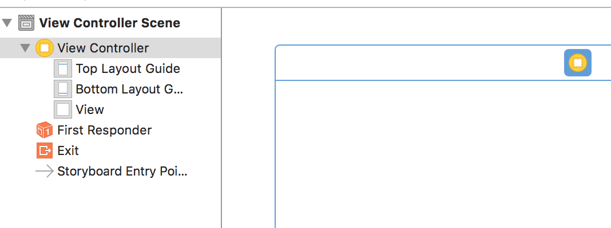
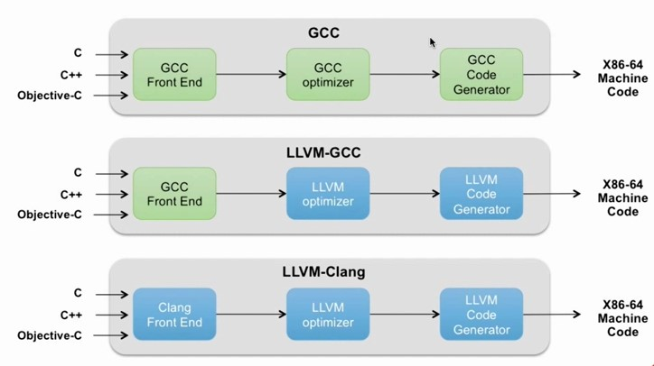
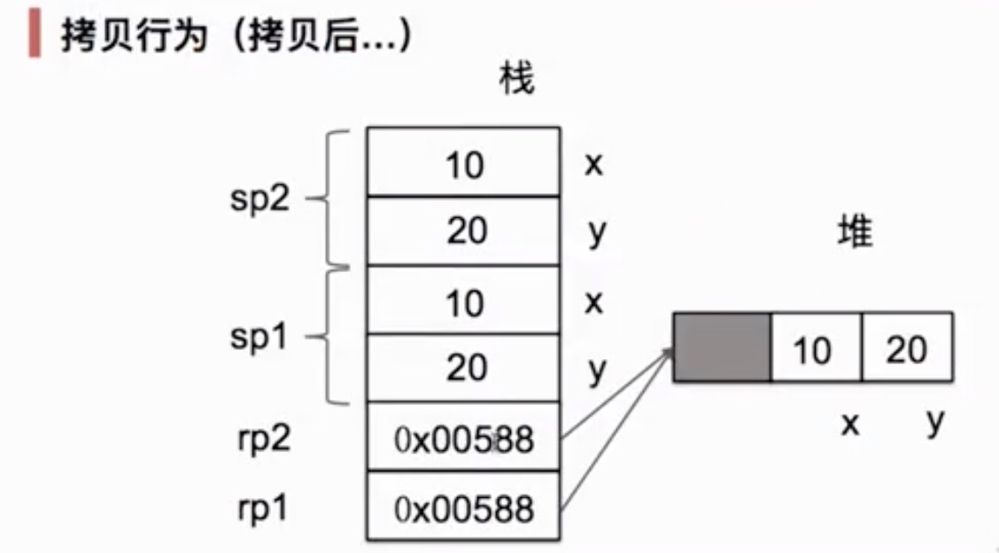
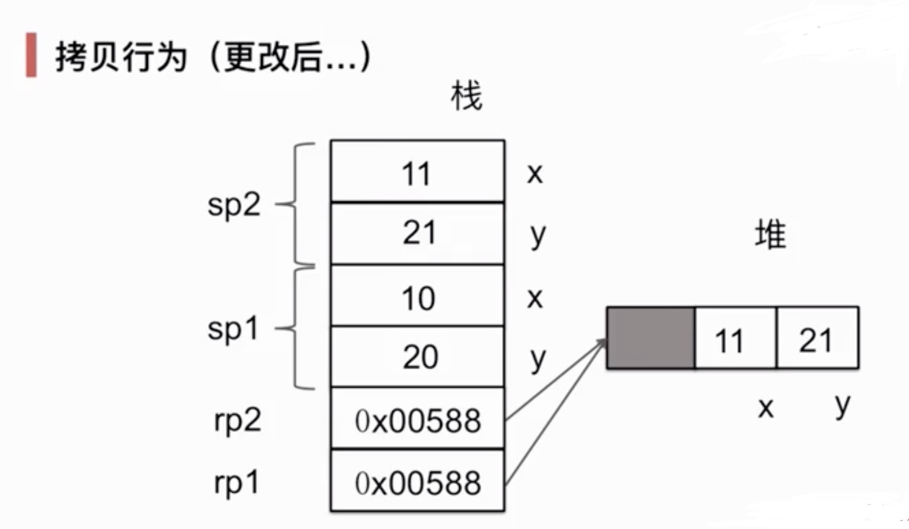
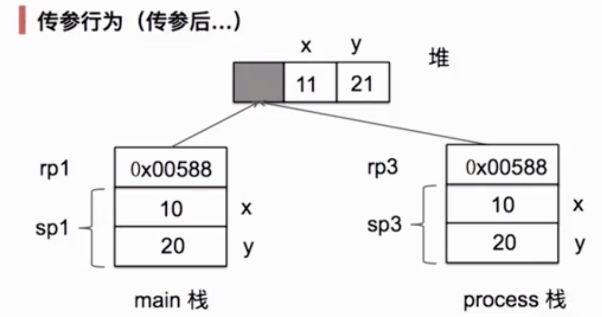
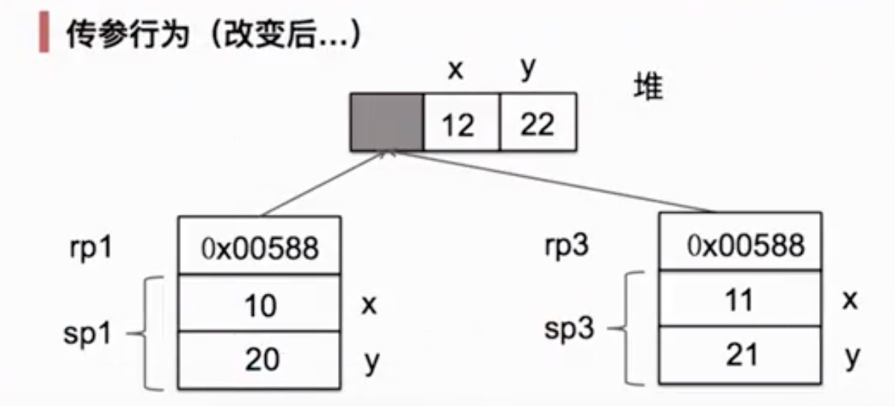

# iOS

## Apple Product

- 1976 年创立
- 1976年推出 Apple I(拍卖300万美元)
- 1977年推出 Apple II
- 1980年推出 Apple III
  － 1983年推出 Apple Lisa
  － 1984年推出 Macintosh（Windows 参考Macintosh）
  － 1991年推出 PowerBook，2006年被MacBook系列所取代
  － 1993年推出 Apple Newton 掌上电脑

## Apple 电脑产品

－ 1998年推出 iMac（一体机）
－ 2005年推出 Mac mini（主机箱）
－ 2006年推出 Mac Pro（服务器）
－ 2006年推出 MacBook
－ 2006年推出 MacBook Pro
－ 2008年推出 MacBook Air
 
－ 2001 iPod
－ 2004 iPod Mini
－ 2005 iPod nano、iPod Shuffle
－ 2007 iPod Classic、iPod Touch（iOS）

## Apple Mobile

- 2007 iPhone
- 2008 iPhone 3G
- 2009 iPhone 3GS
- 2010 iPhone 4 乔布斯离世
- 2011 iPhone 4S
- 2012 iPhone 5
  － 2013 iPhone 5S、iPhone 5C

## Apple 平板电脑

- 2010 iPad
- 2011 iPad 2
- 2012 iPad mini
- 2006 Apple TV

## OS X(v10,x:unix)操作系统

- 2001 年从 Macintosh 电脑上分离出来成为 OS X 10.0
- 2001 OS X 10.1
- 2002 OS X 10.2, 10.3
- 2005 OS X 10.4
- 2006 OS X 10.5
- 2008 OS X 10.6
- 2010 OS X 10.7 appstore
- 2012 OS X 10.8
- 2013 **OS X 10.9** 省电（后台进程），内存压缩
- 2014 OS X 10.10

### OS X系统常规设置

- `& + w` 关闭文件
- `& + q` 关闭应用
- `alt + 选择应用` = 强制退出

- 显示隐藏文件
- `$ defaults write com.apple.finder AppleShowAllFiles -bool true`
- `$ defaults write com.apple.finder AppleShowAllFiles -bool false`

- `$ ddefaults write com.apple.finder AppleShowAllFiles YES`
- `$ defaults write com.apple.finder AppleShowAllFiles NO`

### 下载应用

- [macx.cn](https://www.macx.cn)
- CleanMyMac 应用清理干净删除的应用

###  OS X系统架构

- C/C++, Objective-C, Swift => OS x => Unix

## iOS history

- 2007 iPhone Runs OS x
- 2008 iPhone OS
- 2010 iOS, **iOS4**(multi process)
  - 后台运行进程一段时间，省电模式。不使用OS负责回收
  - 待机比Android更长时间
- 2011 iOS5
- 2012 iOS6
- 2013 iOS7(扁平化)
- 2014 iOS8
 - 不同应用程序通过OS数据交换

### iOS 系统架构

- C/C++, Object-C, Swift => iOS => Unix
- lua语言开发并在IOS设备运行

## iOS 软硬件环境要求

- 硬件环境要求
  - CPU 双核
  - 内存 8G（集成开发环境消耗很多内存）
  - MacBook Pro
  - 测试手机iPhone 5+

- 软件环境要求
  - OS X 10.9.3＋
  - Xcode 6.0+

## Android vs iOS

| 比较   |      iOS      |  Android |
|----------|:-------------:|------:|
| 系统架构 |  基于Unix | 基于Linux的虚拟机 |
| 系统安全性 |    安全、稳定   |   安全性略低 |
| 开发难易度 | 强大的SDK |    SDK也不差 |
| 是否开源 | 不开源 |    开源 |
| 设备的种类 | iPhone/iPad等 |    数不清的设备类型 |
| 用户人群 | 消费能力强的高端用户 |    各种用户人群 |
| 背后的BOSS | Apple |    Google |
| 应用商店 | AppStore(08年上线) |    GooglePlay |

## 创建项目

### Sinble View Application


1. Create a new Xcode project (iPhone/iPad/Mac)
1. iOS
2. Application
3. Single View Application
4. Options
  + Project Name : 项目名
  + Organization Name: 组织名 (dev)
  + Organization Identifier: 组织ID（com.wovert）
  + Language: Swift/Object-C
  + Device : iPad/iPhone/Universal(包括iPad和iPhone)


- Product Name: 项目名称(study)
- Organization Name: 组织机构名称/公司名称 (weiming)
- Organization Identifier: 公司的唯一标识 (com.wovert)
- Bundle Identifier: 应用程序产品的唯一标识 (com.wovert.study)
- Language: 开发语言


- Key: Main Storyboard file base name: `Main` 对应 `Main。storyboard`
- 打开 `Main.storyboard主界面`: 应用程序启动之后之行`view Controller`文件
- View Controller Scene
  - View Controller
- 选中 view Controller 图标  右上角显示`show the idendity inspect`按钮，此文件关联的类是 `ViewController.swift` 文件 
- 应用程序启动之后 ViewController 加载之后之行 `viewDidLoad` 方法
- 在 `viewDidLoad`方法中的最后一行输入`print("Hello World\n")`
- 按下 `Ctrl+r` 运行程序
- 


### 工作空间

> 多个工程项目放在一起方便管理，工作空间可以把所有的工程项目放在工作空间进行管理｀

## 快捷键

- 🏠: Shift
- 飞: Option
- ^: Command

- 代码提示：ESC
- 移动行：alt + command + {[|]}
- 配置编辑器: command + ,

- 运行程序：command + r
- 停止程序：command + .
- 编译程序：command + b

- 显示控件：command + shift + l
- 编辑区：command + enter
- 两个编辑区：command + option + enter
- 两个区域显示：command + option + shifit + enter

- ctrl + 1~6
  - ctrl + 5 显示当前项目文件列表
  - ctrl + 6 选择文件的代码区域

- 导航区域显示隐藏：command + 0
  - 导航选项切换：command + 1~6
- 属性区域显示隐藏：command + alt + 0
  - 属性切换选项：command + option + 1~6
- 调试区域显示隐藏：command + shift + y
  
### 创建 OS X命令行程序项目

- 在工作空间创建 New Project -> OS X -> Command Line Too

### 创建 OS X窗体程序项目

- 在工作空间创建 New Project -> OS X -> Cocoa Application

### 创建 OS X 游戏程序项目

- 在工作空间创建 New Project -> OS X -> Game
- Game Technology
  - SpriteKit: 2D游戏
  - SceneKit: 3D游戏

### 创建 iOS 游戏程序项目

- 在工作空间创建 New Project -> iOS -> Game
- Game Technology
  - SpriteKit: 2D游戏
  - SceneKit: 3D游戏
  - OpenGL ES
    - OpenGL: 开源绘图标准
  - Metal: 苹果绘图标准

## Playground

> 编写程序同时显示变量的变化或调试程序时使用 playground

## iOS Xcode 帮助文档的使用

- 选中原生名字 -> help菜单 -> Quick Help for Selected Item

## 解决问题的途径

- 搜索引擎
  - [bing](http://bing.com)
  - [so](http://so.com)
- 技术交流论坛
- 技术问答平台
  - [stackoverflow](http://stackoverflow.com)
- [github](http://github.com)

## 如何提问

- 语言简洁、问题明了
- 问题清晰
- 定位问题原因
- 特定问题需要描述场景、操作、错误结果

## 程序打包发布到 AppStore

- 模拟器中运行程序
  - hardware 菜单控制模拟器（方向、旋转等操作）
  - 回到主页面：command + shift + h
- 真机中运行程序
  - 1. 必须有开发者证书：https://developer.apple.com
  - 2. 工程项目配置中与真机OS版本一直
    - Deployment Info -> Deployment Target
    - 运行程序
    - 添加 AppleID
    - Window菜单 -> Orgnizer选项 -> device选项卡 -> Screenshot

- 发布程序
  - 1. 选中项目 -> produc菜单 －> Archive 归档
  - 2. 选中项目 -> 按下 Distribute -> App Store -> Next
  - 3. 苹果公司进行审核

## Swift

### 变量

```
var a = 1
var b = 2
```

### 常量

```
let c:Int = 20
```

### 数据类型

#### String类型

- 字符串链接


```
var i = 200
var str = "hello "
str = str + " wovert.com"
//str = str + 10
str = "\(str), world, 100, \(i)"
```

#### 数组

```
var nums = []
var names = String("a","b")
var arr = ["hello", "wovert.com", 100, 200]
```

#### 字典

```
var dict = ["name":"wovert", "age": 2]
dict["gender"] = "30"
```

### 函数

```
func getNums()->(Int, Int) {
  return (2,3)
}
```

### OOP

- 类的动态扩展：不改变类的结构下，扩展类的功能的方式


## iOS WebView

**resource load since it is insecure. Temporary exceptions can be configured via your app's Info.plist**


1. 选择项目
2. info
3. App Transport Security Settings
4. Allow Arbitrary Loads
5. Exception Domains
6. wovert.com 可访问地址

## Swfit 调用 OS

## 调试

- 输出信息定位错误
- 断点调试
  - Step Over: 一步一步
  - Step Into: 进方法
  - Step Out: 出方法


## Objective-C 语言简介

> 简称 ObjC 或 OC，在 C语言基础上做了面向对象扩展

－ 1980年代初由 Brad Cox 和 Tom Love 发明，后来成为 NeXT 的主力语言，后被苹果收购，成为苹果开发平台的助理语言
－ 与 CoCoa 和 Cocoa Touch 框架高度集成，支持开发 Mac OS X、IOS应用
－ 在苹果开发平台上，通过LLVM编译器架构，支持与Swift语言双向互操作

## Objective-C 演技脉络

- 1972，C, Dennis Ritche
- 1982, Smalltalk, Alan Kay
- 1983, C++, Bjarne Stroustrup
- 1983, Objective-C Brad Cox, Tom Love
- 2014, Swift, Chris Lattner

```
++++++++++++++ ++++++++++++++++++++ ++++++++++++++++  ++++++++++++++
+++ Swift ++++ ++++ Objective-C +++ ++++++ C/C++ +++  ++++++++++++++
++++++++++++++ ++++++++++++++++++++ ++++++++++++++++  ++++++++++++++
                                                      ++++++++++++++
++++++++++++++++++++++++++++++++++++++++++++++++++++  ++++++++++++++
+++ LLVM Compile Framework & Objective-C Runtime +++  ++++++++++++++
++++++++++++++++++++++++++++++++++++++++++++++++++++  ++++++++++++++
                                                      ++++++++++++++
++++++++++++++++++++++++++++++++++++++++++++++++++++  ++ Multi-Touch / Alerts / Core Motion / Web View  ++
++++++++++++++++++ Cocoa Touch +++++++++++++++++++++  ++ View Hierarchy / Map Kit / Localization / Image Picker ++
++++++++++++++++++++++++++++++++++++++++++++++++++++  ++ Controls / Camera ++
                                                      ++++++++++++++
++++++++++++++++++++++++++++++++++++++++++++++++++++  ++ Core Audio / JPEG,PNG,TIFF / OpenAL / PDF / Audio Mixing ++
++++++++++++++++++++ Media +++++++++++++++++++++++++  ++ Quartz(2d) / Audio Recording / Core Animation  ++
++++++++++++++++++++++++++++++++++++++++++++++++++++  ++  Video Playback / OpenGL ES ++
                                                      ++++++++++++++
++++++++++++++++++++++++++++++++++++++++++++++++++++  ++ Collections(Core Location) ++
++++++++++++++++++ Core Services +++++++++++++++++++  ++ Address Book / Net Services / Networking / hreading ++
++++++++++++++++++++++++++++++++++++++++++++++++++++  +++ File Access / Preferences) / SQLite / URL Utilities ++
                                                      ++++++++++++++
++++++++++++++++++++++++++++++++++++++++++++++++++++  ++ OXS Kernel / Power Management +++++++++++
++++++++++++++++++++ Core OS +++++++++++++++++++++++  ++ Mach 3.0 / Keychain Access / BSD / Certificates +++
++++++++++++++++++++++++++++++++++++++++++++++++++++  ++ Sockets / File System / Security / Bonjour ++
```

## 如何掌握高级变成语言

- 底层思维：向下，如何把握机器底层从微观理解对象构造
  - 语言构造
  - 编译转换
  - 内存模型
  - 运行时机制
- 抽象思维：向上，如何将我们的周围世界抽象为程序代码
  - 面相对象
  - 组建封装
  - 设计模式
  - 架构模式

## ”时空人“三位一体分析法

- 对时间分析 —— 发生在什么时候？**compile-time VS run-time**
- 空间分析 —— 变量放在哪里? **stack VS heap**
- 人物分析 —— 代码哪里来的？**programmer VS compiler/runtime/framework**

## 两种开发方式

- 1. **Clang** 或 **gcc** 命令行
  - `# clang/gcc -fobjc-arc HelloWorld.m -o HelloWorld`
    - `-fobjc-arc` 支持ARC内存管理
    － 适合调试、研究、微观探测
- 2. Xcode 项目
  - 构建正规工程项目
  - 使用大型框架，追求设计质量与代码组织

### HelloWorld

``` sh
$ vi helloworld/HelloWorld.m

编译
$ clang -fobjc-arc HelloWorld.m -o HelloWorld
$ gcc -fobjc-arc HelloWorld.m -o HelloWorld

运行
$ ./HelloWorld

帮助
$ clang --help
```

## ObjC 编译过程

编译前段工具(gcc/clang) －> 优化器 －> 代码生成器

LLVM: Low Level VirtualMachine



## 学习资源

－ [苹果官方文档](https://developer.apple.com/develop/)
  - [Programming with Objective-C](https://developer.apple.com/library/archive/documentation/Cocoa/Conceptual/ProgrammingWithObjectiveC/Introduction/Introduction.html)
  - [iOS](https://developer.apple.com/library/ios/)

- 苹果开发者大会 WWDC 
  - [2017](https://developer.apple.com/videos/wwdc2017/)
  - [2018](https://developer.apple.com/videos/wwdc2018/)

---

## ObjectC 语言

### Objective-C

> 面向对象语言，C语言的基础上增加了一层最小的面向对象语法，兼容C语言，OC 代码中混入C语言代码，甚至是C++ 代码。可以开发Mac OS X和iOS 移动开发。

### Objective-C发展现状

- 1986， BradCox 第一个纯面向对象语言 **Smalltalk** 基础上写成了 Ojective-C 语言
- 1985，乔布斯被赶出 Apple，成立 NeXT 公司，致力于开发强大且经济的工作站。NeXT 选择 Unix 作为其 OS
- 1988，Steve Jobs 获得了 Objective-C 的使用权，使用 Objective-C 编写 **NeXTSTEP OS**，NeXTSTEP OS 操作更加容易。
- 1994，**NeXT** 和 **SUN** 共同指定制定 **OpenStep API** 标准，其中两个重要的部分是 **Foundation(框架：可以开发Mac OS X程序和iOS程序)** 跟 **Application Kit(PC端界面)**，此时开始命名前缀 `NS`。
- 1995, NeXT 从 Stepstone 获得了 Objective-C 全部版权
- 1996， Steve Jobs 重回苹果公司，把 OpenStep 用于 Mac OS X 操作系统开发，他的版本和开发环境叫 **Cocoa**, 使用 Objective-C 作为基础语言，开发工具 **Xcode** 和 **Interface Builder**。
- 2007，Apple 公司推出 Objective-C2.0，Objective-C 是 Mac OS X 和 iOS 开发的基础语言

- Objective-C编程语言排名
  - 2009，32
  - 2010，8(iPhone 4)
  - 2011，6
  - 2014，3
  - 2015，4(Swift) 
  - [编程语言排名网站](http://www.tiobe.com/index.php/content/paperinfo/tpci/index.html)

### OC 与 C 对比

#### 源文件对比

- C语言源文件.h头文件，.文件

| 文件扩展名 | 源类型 |
| ---- |   ---- |
| .h  | 头文件，用于存放函数声明 |
| .c  | C语言文件，用于实现头文件中声明的方法 |

- OC 中的源文件 .h 头文件，.m 与 .mm 的实现文件

| 文件扩展名 | 源类型 |
| ---- |   ---- |
| .h  | 头文件，用于包含类、方法、属性的声明 |
| .m/.mm  | 类的实现文件，参与编译的文件，用来实现类中声明的方法 |

#### 关键词对比

- C 语言的关键词都可以在 OC源程序中使用
- OC新增的关键字在使用时，注意部分关键字以“@”开头

- C语言关键字：auto double int truct break else long switch case enum register typedef char extern return union const float short unsigned continue or signe void default goto sizeof volatile do if whie static
- OC 中新增的关键字：@interface @implementation @end @public @protected @private @selector @try @catch @throw @finally @protocol @optional @required @class @property @synthesize @dynamic BOOL Class SEL YES NO id self super nil atomic nonatomic retain assign copy block

#### 数据类型对比

- C 语言的数据类型
  - 基本数据类型
    - 整型
      - 短整型
      - 整型
      - 长整型
    - 字符型
    - 浮点型
      - 单精度
      - 双精度
  - 构造类型
    - 数组
    - 结构体
    - 枚举
    - 共用体
  - 指针类型
  - 空类型（void）
- OC 语言的数据类型
  - 基本数据类型
    - 整型
      - 短整型
      - 整型
      - 长整型
      - **布尔类型(BOOL)**
    - 字符型
    - 浮点型
      - 单精度
      - 双精度
  - **Block 类型**
  - 构造类型
    - 数组
    - 结构体
    - 枚举
    - 共用体
  - 指针类型
    - 类
    - **id 类型**
  - 空类型
  - **特殊类型(SEL、nil)**


| 类型 | 描述 |
| ---- |   ---- |
| BOOL  | 只有两个值真(YES)和假(NO) |
| NSObject *  | OC 中的对象类型 |
| id  | 动态对象类型，万能指针 |
| SEL  | 选择器数据类型 |
| block  | 代码块数据类型 |

- OC 中的类
  - 类是用来描述对象的，是一系列方法和属性的集合
  - OC的类声明和实现包括两个部分；**接口部分和实现部分**


#### 流程控制语句对比

- C 语言中使用的流程控制语句OC中都可以应用
  - if statement
  - switch statment
  - while statement
  - do while statement
  - for statement
  - break
  - continue

- 增强 for 循环，用于快速迭代数组或集合
```c
for (int i=0; i<10; i++) {
  printf("%d", i);
}
```

```oc
for (NSString * name in NSArray) {
  NSLog(@"%@", name);
}
```

#### 函数(方法)定义和声明对比

- C 语言中函数的声明和实现
  - 函数声明：`int sum(int a, int b);`
  - 函数实现：`int sum(int a, int b) { return a + b; }`
- OC 中的方法
  - 方法声明：`-(int)sum:(int) a andB:(int) b;`
  - 方法实现：`-(int)sum:(int) a andB:(int) b { return a + b;}`

```oc
对象方法
-(id)initWithString: (NSString *) name;

类型方法
+ (MyClass *)createMyClassWithString: (NSString *)name;
```

#### 面向对象新增语法

- 属性生成器
  - @property
  - @synthesize

```
声明属性
@property (nonatomic, strong) NSString * name;

合成属性
@synthesize name = _name;
```

- 分类
  - 分类与继承
  - 使用分类扩展类，无需子类华

```oc
@interface NSString (MyNSString)
- (NSString *) encryptWithMD5;
@end
```

- 协议
  - 使用协议声明方法
  - 协议类似于接口

```oc
@protocol MyProtocol
-(void)myProtocolMethod;
@end
```

- Foundation 框架
  - 创建和管理集合，如数组和字典
  - 访问存储应用中的图像和其他资源
  - 创建和管理字符串
  - 发布和观察通知
  - 创建日期和时间对象
  - 操控URL流
  - 异步执行代码

#### 新增异常处理

- 用于处理错误信息
- 格式：`@try ... @catch ... @finally`

### 类与对象

- 引用类型 reference type
  - 类 class（占80%）
  - 指针 pointer
  - 块 block
- 值类型 value type
  - 基础数值类型
  - 结构 struct
  - 枚举 enum
- 类型装饰
  - 协议 protocol
  - 类别 category
  - 扩展 extension

### 类与结构（class VS struct）

- 类型与实例
  - 类与对象
  - 结构与值
- 类——引用类型
  - 位于栈上的指针（引用）
  - 位于堆上的实体对象
- 结构——值类型
  - 实例直接位于栈中
- 空间分析
  - 变量在那里？ **运行时内存图**

### 对象的空间分析







### Stack VS Heap

- stack: 存储**值类型**
  - 无ARC(自动引用计数) 负担，由系统自动管理，以执行函数为单位
  - 空间大小编译时确定（参数＋局部变量）
  - 函数执行时，系统立即自动回收 stack
  - 函数之行结束，系统立即自动回收 stack
  - 函数之间通过拷贝值传递
  - 具有局部性，大小有限额，超出会 stack overflow
- heap: 存储引用类型对象
  - 分配有程序员手动请求（创建对象时）
  - 释放由运行时ARC机制自动释放（确定时）
  - 函数之间通过拷贝引用（指针）传递
  - 具有全局性，总体无大小限制（受制于系统内存整体大小）

### 类型成员——Type Member

- 数据成员 data member 描述**对象状态**
  - 实例变量 instance variable(对内,内部状态)
  - 属性 property（对外，外部状态）
- 函数成员 function member 描述对象行为
  - 方法 method
  - 初始化器 init（特殊方法）
  - 析构器 dealloc （特殊方法）

#### 认识属性

- 属性表达实例状态，描述类型对外接口。相比直接访问实例变量，属性可以做更多控制

- 默认情况下，编译器会为属性定义 propertyName 自动合成；
  - 一个 getter 访问器方法：propertyName
  - 一个 setter 访问器方法：setPropertyName
  - 一个实例变量 _propertyName

- 可自定义访问器的方法，也可更改访问器方法名、或实例变量名
- 可以使用静态全局变量（C语言）＋类方法，模拟类型属性

#### 实例变量

- 可以定义实例变量，而不定一属性。只有实例变量，没有类变量（可以结合C语言模拟）。
- 如果同时自定义了getter和setter访问器的方法，或者针对只读属性定义了 getter访问器方法，编译器将不再合成实例变量。

- 再类外一律使用属性来访问，类内大多也通过 self 使用属性访问。只有一下情况使用实例变量来访问
  - 初始化器 init
  - 析构器 dealloc
  - 自定义访问器方法


## Warning

App Transport Security has blocked a cleartext HTTP (http://) resource load since it is insecure. Temporary exceptions can be configured via your app's Info.plist file.

解决方案：

注 : App Transport Security (ATS) 是 IOS9 中引入的新特性

以上用一句话概括就是: 新特性要求 App 内访问的网络必须使用HTTPS协议

- 解决方案
  - 1. 在 Info.plist 中添加NSAppTransportSecurity类型Dictionary。
  - 2. 在NSAppTransportSecurity下添加NSAllowsArbitraryLoads类型Boolean, 值设为YES

## swift4-函数的函数实际参数标签和形式参数名

### 形式参数 = 实际参数标签 + 形式参数名

- 即：每一个函数的 形式参数 都包含 实际参数标签 和 形式参数名。
- 实际参数标签：用在调用函数的时候（在调用函数的时候每一个实际参数前边都要写实际参数标签）。
- 形式参数名：用在函数的实现当中

注意：**swift默认**情况下，形式参数使用它们的**形式参数名**作为**实际参数标签**。

例如：

``` swift
func someFunction(firstParameterName: Int, secondParameterName: Int) {}
```
firstParameterName和secondParameterName既是实际参数标签，也是形式参数名。

### 指定实际参数标签

但是有时候为了使函数更具**可读性和语义性**，就可以指定一下**实际参数标签**。
例如：

``` swift
func greet(person: String, from hometown: String) -> String {
    return "Hello \(person)!  Glad you could visit from \(hometown)."
}
print(greet(person: "Bill", from: "Cupertino"))
```

代码中的 'frome’就是指定的实际参数标签

### 省略实际参数标签

如果对于函数的形式参数不想使用实际参数标签的话，可以利用下划线（ _ ）来为这个形式参数代替显式的实际参数标签。
例如：

``` swift
func someFunction(_ firstParameterName: Int, secondParameterName: Int) {
    // In the function body, firstParameterName and secondParameterName
    // refer to the argument values for the first and second parameters.
}
someFunction(1, secondParameterName: 2)
```

## 结构体与类的区别

1. 结构体没有继承
2. 结构体是值类型，类是引用类型

